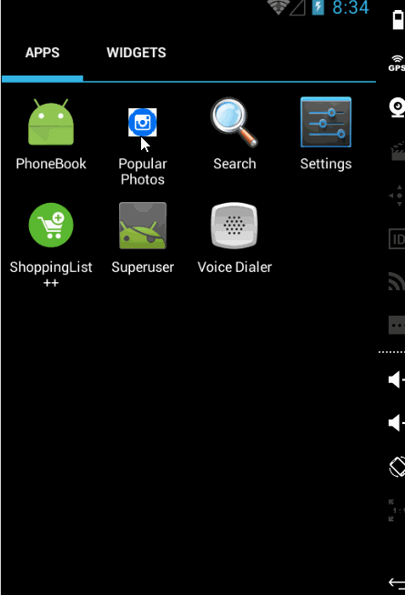

# Instagram_Photo_Viewer
An small demo app to complete the homework for week 1. See the Tutorial on our cliffnotes for a step-by-step tutorial.

Time spent: 22 hours implementation (included searching) in total
 - 12/3: 5 hours
 - 13/3: 10 hours
 - 14/3: 7 hours

Implement link: https://github.com/TienVNguyen/Android/tree/master/CoderSchool_VN/Classes/1_Exercise/Instagram_Photo_Viewer

App link: https://github.com/TienVNguyen/Android/tree/master/CoderSchool_VN/Classes/1_Exercise/Instagram_Photo_Viewer

Completed these requirements:

 * [x] User can scroll through current popular photos from Instagram (5 points)
       For each photo displayed, user can see the following details:
 * [x] Graphic, Caption, Username (2 points)
 * [x] Optional - relative timestamp, like count, user profile image (3 points)

The following advanced user stories are optional but recommended:
 * [x] Advanced: Add pull-to-refresh for popular stream with SwipeRefreshLayout (1 point)
 * [x] Advanced: Show latest comment for each photo (bonus: show last 2 comments) (1 point + 1 bonus)
 * [x] Advanced: Display each user profile image using a RoundedImageView (2 points)
 * [x] Advanced: Display a nice default placeholder graphic for each image during loading (read more about Picasso) (1 point)
 * [x] Advanced: Improve the user interface through styling and coloring (1 to 5 points depending on the difficulty of UI improvements)
 * [x] Bonus: Allow user to view all comments for an image within a separate activity or dialog fragment (3 points)
 * [x] Bonus: Allow video posts to be played in full-screen using the VideoView (2 points)
 * [x] Bonus: Apply the popular Butterknife annotation library to reduce view boilerplate. (1 point)

 
Notes:

Walkthrough of all functionalities:

